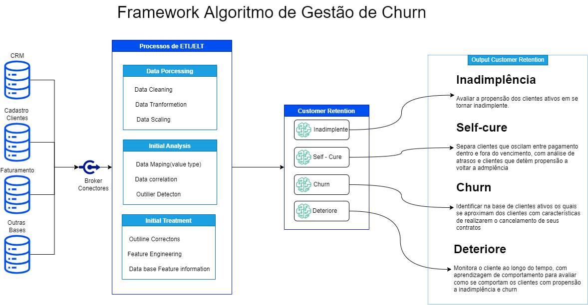

# Motor de churn

O Motor Churn, utiliza um conjunto de algoritmos de IA com o objetivo de atribuir uma probabilidade do Cliente abandonar a marca, serviço ou produto oferecido , direcionando assim os times de retenção e marketing entre outros, na elaboração de ações personalizas.

Pensando no custo e desgaste para as Empresas durante o processo de Churn  desenvolvemos a Jornada Customer Retetion

## O Framework

Completar com informações do framework

## Fluxo de trabalho
completar criando fluxo de trabalho ideal

### Teste A/B

Esplicar teste A/B