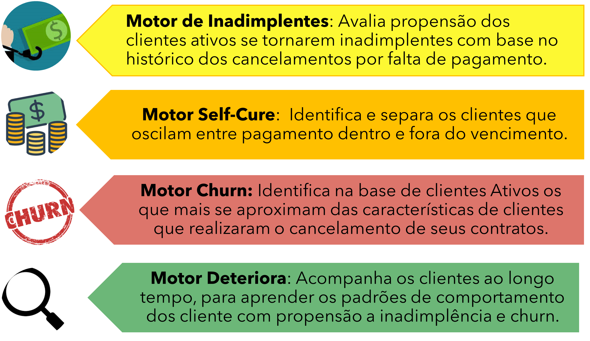

# Motor de Churn

O Motor Churn, utiliza um conjunto de algoritmos de IA com o objetivo de atribuir uma probabilidade do Cliente abandonar a marca, serviço ou produto oferecido , direcionando assim os times de retenção e marketing entre outros, na elaboração de ações personalizas.

Pensando no custo e desgaste para as Empresas durante o processo de Churn  desenvolvemos a Jornada Customer Retetion

## **O Framework**

O modelo de churn irá avaliar os clientes e classificá-los com suas respectivas probabilidade de propensão ao cancelamento de contratos. O modelo terá como target contrato de clientes Cancela ou Não Cancela.

É realizado em fases para atender a demanda do cliente, que realiza campanhas de retenção periodicamente. O modelo de churn auxilia nas campanhas de retenção com a classificação dos clientes(contratos) e facilitando ao agente de retenção identificar qual cliente apresenta risco de cancelamento de contrato.

## **Fluxo de trabalho para validação**

A seguir apresentamos proposta de fluxo de trabalho para utilização do Motor de Churn

É primordial em uma avaliação o controle total sobre todas as interações com o grupo experimental, por isso este grupo não pode ser maior que a capacidade sua capacidade de controla-lo, pois este grupo serve tanto para avaliar a efetividade das ações quando a qualidade do modelo de propensão a churn.

## **Teste Grupo Controle** 

 O método científico para pesquisar são utilizados para diversos estudos. O método científico começa com uma observação, o que leva o cientista a fazer um questionamento. Depois ele apresenta uma hipótese, que é uma explicação a ser testada para responder a questão.

Uma hipótese não está necessariamente certa. Na verdade é uma 'melhor opção', e o cientista deve testa-la para verificar sua correção. Cientistas testam hipóteses fazendo predições: Se a hipótese X é correta, então Y deve ser verdadeiro. Daí eles fazem experimentos ou observações para verificar se as suas predições estão corretas. Se estiverem, a hipótese é mantida. Se não estiverem, talvez seja hora para uma nova hipótese.

Quando possível, os cientistas testam suas hipóteses usando experimentos controlados. Um experimento controlado é um teste científico feito sob condições controladas, o que significa que apenas um (ou poucos) fatores são alterados a cada vez, enquanto todos os outros são mantidos constantes.

#### **Grupos Controle e Experimental**

Há dois grupos no experimento e eles são idênticos, exceto que um recebe um tratamento, no caso da gestão de churn alguma ação com objetivo de reter o cliente, enquanto o outro não recebe nada segue vida normal. O grupo que recebe o tratamento num experimento é chamado de grupo experimental, enquanto o grupo que não recebe o tratamento é chamado de grupo controle. O grupo controle fornece um padrão, ou referência, que permite avaliar se o tratamento tem um efeito.

#### **Variáveis Independentes e Dependentes**

O fator que é diferente entre os grupos de controle e experimental, neste caso o tipo de ação, é conhecido como a variável independente. Esta variável é independente porque ela não depende do que acontece no experimento. Ao invés, ela é algo que o pesquisador aplica ou escolhe ele mesmo.
Em contraste, a variável dependente num experimento é a resposta que é medida para ver se o tratamento tem um efeito. Neste caso, a fração de clientes retidos é a variável dependente. A variável dependente depende da variável independente, e não vice-versa.

