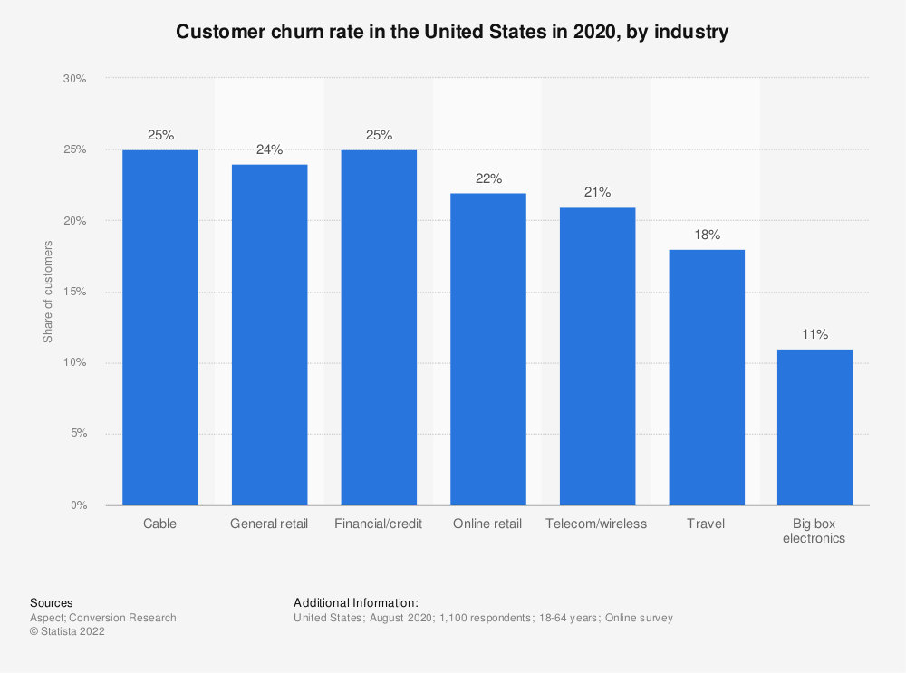

# Lumini Gestão de Churn Rate

## O que é índice de Churn?

O índice de Churn ou Churn rate, em inglês, é uma métrica utilizada por empresas para calcular a taxa de cancelamento ou desistência de clientes em um determinado período. 

O resultado desse cálculo interfere diretamente na receita do negócio e, por isso, deve ser levado a sério pelos gestores.

Essa métrica pode ser utilizada por empresas de qualquer setor, mas tem uma importância particular àquelas que funcionam como SaaS (sigla para Software as a Service) e oferecem serviços por assinatura a seus usuários. 

É geralmente mais caro conquistar novos clientes do que manter os já existentes. Em muitos setores, o custo de aquisição de novos clientes pode ser cinco vezes superior ao seu custo de retenção (KURTZ e CLOW, 1998). No setor bancário americano, por exemplo, estima-se que 30% da base de clientes seja vulnerável à migração (ACCENTURE, 2009).

O churn, também, está diretamente associado ao tempo em que o indivíduo permanece como cliente de uma organização, portanto está diretamente relacionado ao conceito de Consumer Life Time Value (CLV ou valor do ciclo de vida do cliente) (NESLIN e outros, 2006). Glady e outros (2009), usando uma abordagem centrada no cliente, definiram churner como aquele cliente cujo CLV é decrescente ao longo do tempo.

Churn rate é capaz de revelar a fidelidade dos clientes a uma empresa, indicando sua capacidade de reter consumidores satisfeitos — seja qual for o modelo de negócio.

Se hoje o churn é um problema sério no seu negócio, ou se você está buscando evitar que ele se torne um, é essencial enxergá-lo de forma realista, isto é, como sintoma de uma doença mais profunda.

E essa doença é o fracasso na hora de garantir o resultado desejado dos clientes, seja porque você não consegue entregar o sucesso que eles buscam ou porque você está conquistando clientes com baixo potencial

> *“o churn é o indício de que algo está errado, ou seja, ele não é o problema propriamente dito”.* 
> 
> **Lincoln Murphy**

## Tipos de Churn

- ### Churn voluntário

O Churn voluntário é um dos tipos de Churn que ocorrem com maior frequência no mercado. Isso porque ele indica cancelamentos feitos pelos próprios consumidores, de forma espontânea.

Se você identificar um aumento da taxa de Churn voluntário na sua empresa, o indicado é conduzir uma pesquisa na etapa de cancelamento para que usuários possam indicar o motivo por trás da desistência. Entre as principais razões, podemos destacar:

- insatisfação com o produto;  
- questões financeiras;
- ausência de suporte ao cliente;
- falta de personalização no atendimento;
- o produto não gerou valor para o cliente;
- o produto não gerou benefícios necessários para fidelização. 

É preciso entender o que causou o descontentamento, principalmente caso aconteça uma onda de cancelamentos com a mesma justificativa. Se o usuário tiver cancelado o serviço devido a problemas financeiros, por exemplo, é uma oportunidade para tentar reativar esse cliente oferecendo alguma promoção ou benefício.

- ###  Churn involuntário

O Churn involuntário é a métrica que calcula a taxa de cancelamentos que acontecem sem a vontade do cliente. Alguns motivos para que isso aconteça são:

problema na cobrança de pagamento, como no caso de cartões de crédito bloqueados;
- fraude detectada;
- falta de pagamento;
- falha na transação de pagamento;
- fim do contrato sem renovação por parte do usuário.
- 
A melhor maneira de evitar esse tipo de Churn rate é utilizar um sistema automatizado que informe o cliente sobre a necessidade de atualizar o método de pagamento ou renovar o plano de assinatura.

- ###  Revenue Churn

O revenue Churn pode ser calculado a partir da taxa de cancelamentos e taxa de downgrades — medida em receita perdida no período. O downgrade acontece quando os usuários de um serviço trocam seus pacotes por opções mais baratas.

Embora não seja de fato um cancelamento, o downgrade também impacta a receita da empresa, já que o faturamento diminui. Para calcular seu índice de revenue Churn, você pode realizar o seguinte cálculo:

(receita perdida no período / receita total no período) x 100 = % de Churn

- ###  Early churn

Early churn pode ser traduzido como um cancelamento precoce, que ocorre poucos dias após a venda ou aquisição de um produto ou serviço pelo usuário.

## Dicas para ajudar a reduzir o Churn
Além de acompanhar as métricas e nunca deixar de realizar o cálculo de Churn de acordo com as necessidades da empresa, é preciso que os gestores realizem ações assertivas e frequentes para manter o índice no nível mais baixo possível.

- #### Entenda por que os clientes cancelam o serviço 

Sem entender os motivos que fazem seus clientes desistirem do seu produto, fica difícil saber quais atitudes tomar para diminuir o Churn. O ideal é acrescentar uma questão não-obrigatória que dê ao usuário a oportunidade de explicar o que aconteceu.

Segundo a Lee Resources, basta a empresa resolver uma reclamação a favor do cliente e terá 70% de chance dele voltar a fazer negócios com ela.

A melhor maneira de apresentar essa questão é em formato de enquete com algumas das opções mais frequentes já visíveis (insatisfação, questões financeiras, preferência pela concorrência, pouca utilização do serviço, etc.) e uma caixa de texto que permita à pessoa acrescentar mais informações sobre o cancelamento.

- #### Crie a cultura do feedback

Ainda batendo na tecla da relação com o consumidor, é necessário manter sempre aberto um canal de diálogo para que ele possa expressar suas opiniões sobre o serviço oferecido.

Isso não deve ser feito somente quando for a hora de mapear possíveis cancelamentos, mas como forma de promover a contínua evolução da plataforma para atrair, também, futuros clientes.

- #### Mapeie clientes com maior chance de cancelamento
  
Pesquisas também podem ser aliadas na hora de evitar que clientes cancelem suas assinaturas. Ouvir o que os usuários da sua plataforma têm a dizer é importante para entender suas necessidades e mantê-los fiéis à marca.

As pesquisas são grandes aliadas, mas podem ser caras e demoradas. Outra forma de mapear os clientes propensos a deixar o serviço é criar [algoritmos de machine learning](churn.md) capaz de apontar esta probabilidade.

